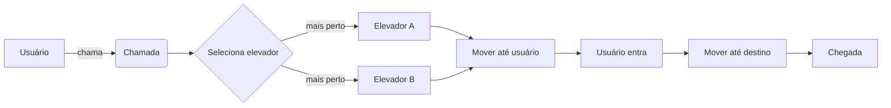

# Elevador Desafio 🚪🛗


Simulador didático de elevadores em Python — fácil de entender e estender.

## Sumário

- [Demonstração visual](#demonstração-visual)
- [Funcionalidades](#funcionalidades)
- [Como executar](#como-executar)
- [Exemplo rápido](#exemplo-rápido)
- [Diagrama de fluxo](#diagrama-de-fluxo)
- [Estrutura do projeto](#estrutura-do-projeto)
- [Contribuição](#contribuição)
- [Melhorias sugeridas](#melhorias-sugeridas)
- [Licença](#licença)

## Demonstração visual

> (adicione um GIF ou screenshot aqui para tornar o README ainda mais visual)


## Funcionalidades

- Seleção do elevador mais próximo (desempate por nome)
- Movimentação mostrada passo-a-passo
- Validação de entrada com opção de sair (`q`)
- Andares válidos: **-2, -1, 0, 1, 2, 3, 4**

## Como executar

No terminal, dentro da pasta do projeto, execute:

```bash
python elevador.py
```

No Windows, use o comando `python` conforme configurado no PATH.

## Exemplo rápido

Entrada/saída de exemplo (usuário à esquerda, programa à direita):

```text
> Em qual andar você está?  2
> Para qual andar você quer ir?  -1

Elevador A está no andar 0.
Elevador A foi chamado para o andar 2.
Distância até o usuário: 2

Elevador A indo até o andar do usuário...
Elevador A passando pelo andar 1.
Elevador A passando pelo andar 2.
Usuário entrou no Elevador A.
Elevador A indo para o andar -1...
Elevador A passando pelo andar 1.
Elevador A passando pelo andar 0.
Elevador A passando pelo andar -1.

Chegou ao andar -1.
Nova posição de Elevador A: andar -1
```

## Diagrama de fluxo



## Estrutura do projeto

- `elevador.py` — código principal do simulador
- `README.md` — documentação (você está aqui)

## Contribuição

1. Abra uma issue descrevendo a ideia ou bug.
2. Crie um branch, implemente e envie um pull request.

Sugestões rápidas: incluir GIFs, adicionar testes automatizados, e permitir
configuração externa dos elevadores.

## Melhorias sugeridas

- Suportar configuração externa (JSON/YAML) para número e posição inicial dos elevadores.
- Modo não interativo para rodar simulações em lote.
- Adicionar testes unitários e CI.

## Licença

Este projeto está disponível sob a licença MIT.
